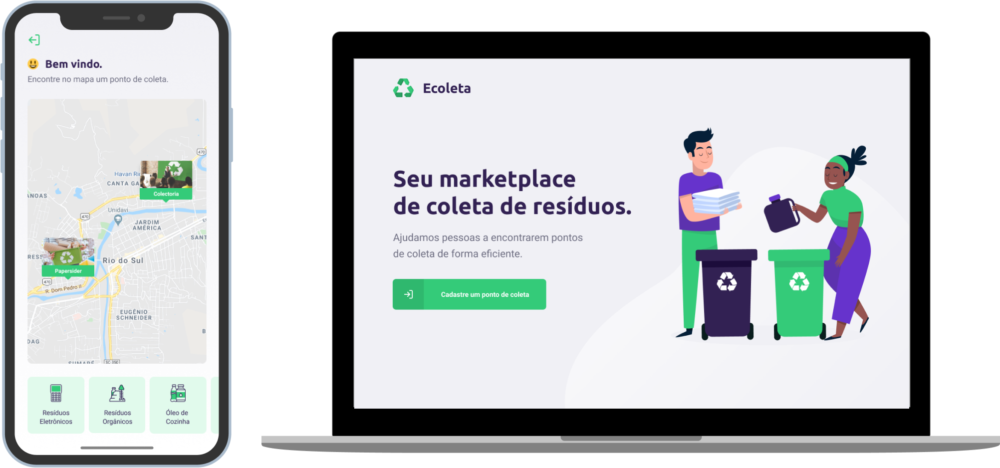

<h1 align="center">
    
</h1>

<h4 align="center"> 
	:heavy_check_mark: ♻ Next Level Week #01 - Booster ♻ :heavy_check_mark:
</h4>

  
</img>  

  <a href="#rocket-tecnologias">Tecnologias</a>&nbsp;&nbsp;&nbsp;|&nbsp;&nbsp;&nbsp;
  <a href="#-projeto">Projeto</a>&nbsp;&nbsp;&nbsp;|&nbsp;&nbsp;&nbsp;
  <a href="#-layout">Layout</a>&nbsp;&nbsp;&nbsp;|&nbsp;&nbsp;&nbsp;
  <a href="#-como-contribuir">Como contribuir</a>&nbsp;&nbsp;&nbsp;|&nbsp;&nbsp;&nbsp;
  <a href="#memo-licença">Licença</a>

 

  

## 🚀 Tecnologias

Esse projeto foi desenvolvido com as seguintes tecnologias:

- [Node.js](https://nodejs.org/en/)
- [React](https://reactjs.org)
- [React Native](https://facebook.github.io/react-native/)
- [Expo](https://expo.io/)

## 💻 Projeto

O **Ecoleta** é um marketplace que ajuda pessoas a encontrarem pontos de coleta de resíduos de forma eficiente.

## 🔖 Layout

Você pode visualizar o layout do projeto no formato através [desse link](https://www.figma.com/file/9TlOcj6l7D05fZhU12xWT3/Ecoleta-Booster?node-id=0%3A1). Lembrando que você irá precisar ter uma conta no [Figma](http://figma.com/).

## :memo: Licença

Esse projeto está sob a licença MIT. Veja o arquivo [LICENSE](LICENSE.md) para mais detalhes.

---

Feito com ♥ by Rocketseat :wave: [Participe da nossa comunidade!](https://discordapp.com/invite/gCRAFhc)

